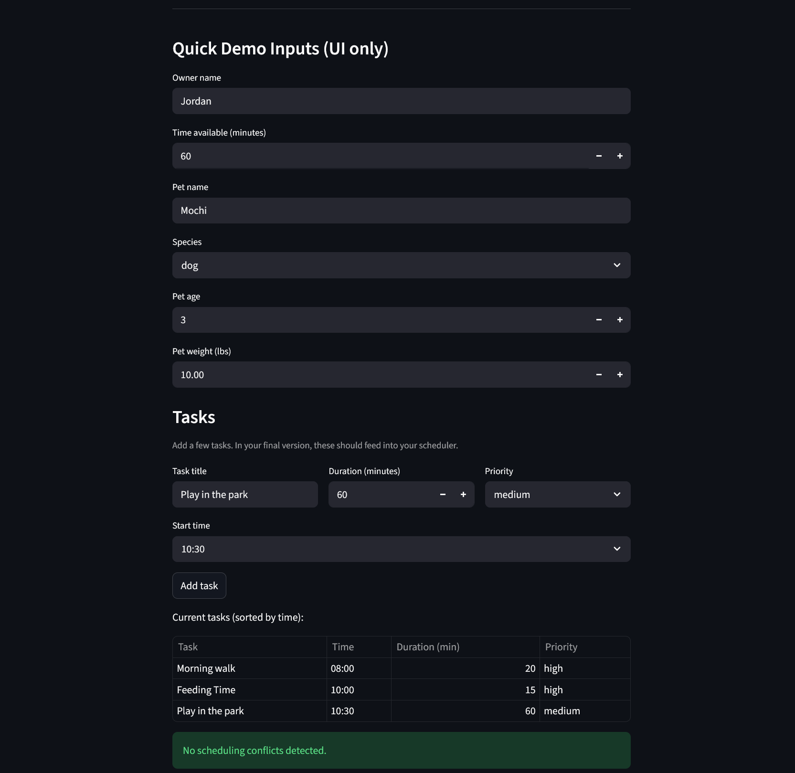

# PawPal+ (Module 2 Project)

This is **PawPal+**, a Streamlit app that helps a pet owner plan care tasks for their pet.

## Features

- **Task management** — add care tasks for your pet with a title, start time, duration, and priority level
- **Time-ordered schedule** — tasks are automatically sorted chronologically so you always see the day in order
- **Conflict detection** — overlapping tasks are flagged with a warning before your day starts
- **Filtered views** — filter the task list by pet or completion status
- **Recurrence support** — mark a task complete and a new one is automatically created for the next occurrence (daily or weekly)

## Demo

<a href="screenshot.png" target="_blank"></a>

## Getting started

### Running The App

```bash
python -m venv .venv
source .venv/bin/activate  # Windows: .venv\Scripts\activate
pip install -r requirements.txt
streamlit run app.py
```

## Smarter Scheduling

The `Scheduler` class includes logic to make daily pet care planning more reliable:

- **Conflict detection** (`detect_conflicts`): Flags any two tasks that are scheduled at overlapping times on the same day, so you can catch accidental double-bookings before they happen.
- **Chronological sorting** (`sort_by_time`): Reorders all tasks by date and start time, giving you a clean, time-ordered view of the day.
- **Filtered views** (`filter_tasks`): Lets you slice the task list by completion status or pet name.
- **Prioritized schedule building** (`build_schedule`): Selects and orders tasks to fit within the owner's available time budget.

## Testing PawPal+

Run the full test suite from the `pawpal-starter` directory:

```bash
python -m pytest
```

The test suite covers the following behaviors:

| Group | What is tested |
|---|---|
| **Sorting** | Tasks in mixed order come out chronologically; date takes priority over time of day |
| **Recurrence** | Completing a daily task creates a new task dated `+1 day`; weekly creates `+7 days`; one-time tasks return `None` |
| **Conflict detection** | Double-booked and overlapping slots are flagged; back-to-back tasks and same-time tasks on different dates are not flagged |

> **Confidence Level: 3/5 ⭐**
> *The core behaviors — sorting, recurrence, and conflict detection — are well-tested and reliable, but I am capping confidence at 3 stars because `build_schedule` (the prioritized daily plan builder) isn't yet implemented. We can't be totally sure that the system functions perfectly, without it.*