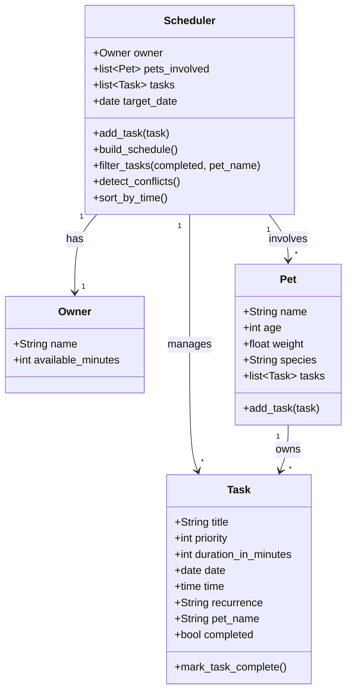

# PawPal+ Project Reflection

## 1. System Design

**a. Initial design**

Three core user actions a user should be able to perform:
1. Add pet(s) along with pet info
2. See today's tasks
3. Add/edit tasks

I'm planning on adding these objects:
- `Owner`
  - attributes: `name`, `available_minutes`
  - methods: N/A
- `Pet`
  - attributes: `name`, `age`, `weight`, `species`, `tasks (list[Task])`
  - actions: `add_task(task)`
- `Task`
  - attributes: `title`, `priority`, `duration_in_minutes`, `date`, `completed`
  - actions: `mark_task_complete()`
- `Scheduler`
  - attributes: `owner`, `pets_involved`, `tasks (list[Task])`, `target_date`
  - actions: `add_task(task)`, `build_schedule()`

The `Scheduler` class primarily "orchestrates" the rest, though `Pet` and `Task` also carry behavior of their own.

**b. Design changes**

After asking Copilot, I changed `Scheduler` to be able to hold more than one `Pet`, allowing it to handle more than one at a time. I also added a `target_date` parameter so the `Scheduler` can know what to do with `Task` objects with differing date values.

To support testing, `Task` gained a `completed` boolean (default `False`) and a `mark_task_complete()` method to flip it. `Pet` gained a `tasks` list and an `add_task()` method so individual pets can track their own tasks directly, rather than all tasks living only on the `Scheduler`.

---

## 2. Scheduling Logic and Tradeoffs

**a. Constraints and priorities**

The scheduler is designed to consider two main constraints: the owner's available time (in minutes) and each task's priority number. Lower priority numbers are more urgent, so a task with priority 1 should be scheduled before one with priority 3.

Right now, `build_schedule()` is not yet implemented and just returns an empty list. So in practice, the app doesn't enforce the time budget or cut any tasks. Conflict detection does work, but it only warns the user rather than removing tasks automatically.

**b. Tradeoffs**

The `detect_conflicts` method checks every task against every other task. Copilot suggested sorting tasks by start time first and scanning through once, which would be faster for large lists.

I kept the simpler version because the app will only ever have a small number of tasks per day, so the speed difference doesn't matter. The current approach is easier to read and understand, which is more valuable here than a small performance gain.

---

## 3. AI Collaboration

**a. How you used AI**

I used AI tools in three main ways: design brainstorming, code generation, and explaining concepts.

For brainstorming, I asked questions like "what classes should a pet scheduling app have?" and "what methods does a Scheduler need?" Those early structural questions were the most valuable — they helped me sketch out the four-class design before writing any code.

For code generation, I used AI to scaffold methods like `mark_task_complete()` and the `filter_tasks()` logic, then reviewed and adjusted them to fit what I actually needed.

For concept explanations, I asked things like "what is a dataclass in Python?" and "how does `replace()` work?" — especially useful when I ran into unfamiliar Python features.

**b. Judgment and verification**

When Copilot suggested rewriting `detect_conflicts` to sort tasks by start time first and only check each task against the next one, I didn't accept it right away. I wanted to understand why before changing the code. When I thought it through, I realized the simpler nested loop was easier to read and there was no real performance concern—this app will never have more than a handful of tasks in a day. So I kept the simpler version. I evaluated it by tracing through the logic manually and confirming the test cases still passed.

---

## 4. Testing and Verification

**a. What you tested**

I tested three core behaviors: chronological sorting, recurring task generation, and conflict detection.

Sorting tests made sure that tasks added in mixed order come out correctly sorted by date first, then by time of day within the same date.

Recurrence tests verified that calling `mark_task_complete()` on a daily task creates a new task dated one day later, and a weekly task creates one dated seven days later. One-time tasks return `None` as expected.

Conflict detection tests confirmed that two tasks with overlapping time windows get flagged, while back-to-back tasks (no overlap) and same-time tasks on different dates are not flagged. These were important to test because the edge cases—especially back-to-back—are easy to get wrong with off-by-one mistakes in the interval comparison.

**b. Confidence**

I'd say about 3/5. The three behaviors I tested work reliably and I covered the edge cases I could think of.

What holds me back from higher confidence is that `build_schedule()` isn't implemented yet. Until the prioritization and time-budget logic actually runs, the scheduler isn't doing its main job. That's a significant untested surface area.

If I had more time, I'd want to test what happens when no tasks fit within the owner's available minutes, and what the behavior is when two tasks start at exactly the same time on the same day.

---

## 5. Reflection

**a. What went well**

The conflict detection. Getting the overlap logic right took some thought; two time windows overlap only when neither one ends before the other begins. Once I understood that, the `_tasks_overlap` helper made the logic clean and easy to read. It also felt like the most "real" piece of the project: something that could actually prevent a mistake a pet owner would make in real life.

**b. What you would improve**

`build_schedule()` is the obvious gap. Right now it returns an empty list, which means the prioritization and time-budget system doesn't actually run. I'd implement it as a greedy algorithm that sorts tasks by priority number then adds them one at a time until the owner's available minutes run out.

**c. Key takeaway**

AI is very good at generating structure, from class names to method signatures to data models. However, it can't tell you what tradeoffs actually matter for your specific situation. When Copilot suggested the faster conflict detection algorithm, it wasn't exactly wrong, but it also didn't know that this app would never have more than a dozen tasks a day. That judgment had to come from me. AI helps you build faster but has a hard time understanding your real intent.