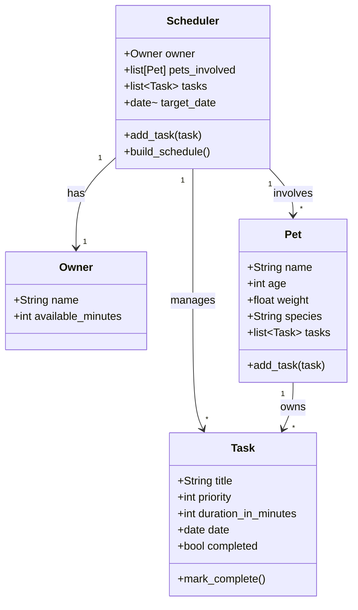

# PawPal+ Project Reflection

## 1. System Design

**a. Initial design**

Three core user actions a user should be able to perform:
1. Add pet(s) along with pet info
2. See today's tasks
3. Add/edit tasks

I'm planning on adding these objects:
- `Owner`
  - attributes: `name`, `available_minutes`
  - methods: N/A
- `Pet`
  - attributes: `name`, `age`, `weight`, `species`, `tasks (list[Task])`
  - actions: `add_task(task)`
- `Task`
  - attributes: `title`, `priority`, `duration_in_minutes`, `date`, `completed`
  - actions: `mark_complete()`
- `Scheduler`
  - attributes: `owner`, `pets_involved`, `tasks (list[Task])`, `target_date`
  - actions: `add_task(task)`, `build_schedule()`

The `Scheduler` class primarily "orchestrates" the rest, though `Pet` and `Task` also carry behavior of their own.

**b. Design changes**

After asking Copilot, I changed `Scheduler` to be able to hold more than one `Pet`, allowing it to handle more than one at a time. I also added a `target_date` parameter so the `Scheduler` can know what to do with `Task` objects with differing date values.

To support testing, `Task` gained a `completed` boolean (default `False`) and a `mark_complete()` method to flip it. `Pet` gained a `tasks` list and an `add_task()` method so individual pets can track their own tasks directly, rather than all tasks living only on the `Scheduler`.

---

## 2. Scheduling Logic and Tradeoffs

**a. Constraints and priorities**

- What constraints does your scheduler consider (for example: time, priority, preferences)?
- How did you decide which constraints mattered most?

**b. Tradeoffs**

- Describe one tradeoff your scheduler makes.
- Why is that tradeoff reasonable for this scenario?

---

## 3. AI Collaboration

**a. How you used AI**

- How did you use AI tools during this project (for example: design brainstorming, debugging, refactoring)?
- What kinds of prompts or questions were most helpful?

**b. Judgment and verification**

- Describe one moment where you did not accept an AI suggestion as-is.
- How did you evaluate or verify what the AI suggested?

---

## 4. Testing and Verification

**a. What you tested**

- What behaviors did you test?
- Why were these tests important?

**b. Confidence**

- How confident are you that your scheduler works correctly?
- What edge cases would you test next if you had more time?

---

## 5. Reflection

**a. What went well**

- What part of this project are you most satisfied with?

**b. What you would improve**

- If you had another iteration, what would you improve or redesign?

**c. Key takeaway**

- What is one important thing you learned about designing systems or working with AI on this project?
